# Razorpay Data Modeling Project

This project demonstrates a comprehensive data modeling approach for a payment processing platform like Razorpay, implementing the modern data architecture using Bronze-Silver-Gold layers with Data Vault 2.0 methodology.

## 📋 Overview

The project creates a complete data pipeline that transforms raw payment data through multiple layers:

1. **Bronze Layer**: Raw data ingestion from simulated payment transactions
2. **Silver Layer**: Data Vault 2.0 implementation for scalable data warehousing
3. **Gold Layer**: Kimball dimensional model for analytics and reporting

## 🏗️ Architecture

### Bronze Layer (Raw Data)
- `raw_merchant_profiles`: Merchant registration and status information
- `raw_merchant_subscriptions`: Pricing plans and subscription history
- `raw_merchant_transactions`: Payment transaction records

### Silver Layer (Data Vault 2.0)
**Hubs** (Business Keys):
- `HUB_MERCHANT`: Unique merchant identifiers
- `HUB_TRANSACTION`: Unique transaction identifiers  
- `HUB_SUBSCRIPTION`: Unique subscription identifiers

**Satellites** (Descriptive Data):
- `SAT_MERCHANT_PROFILE`: Merchant details (name, status, signup date)
- `SAT_SUBSCRIPTION_DETAILS`: Subscription information (tier, fees, dates)

**Links** (Relationships):
- `LNK_MERCHANT_SUBSCRIPTION`: Merchant-to-subscription relationships
- `LNK_MERCHANT_TRANSACTION`: Merchant-to-transaction relationships

### Gold Layer (Dimensional Model)
**Dimensions**:
- `DIM_MERCHANT`: Merchant dimension table
- `DIM_SUBSCRIPTION`: Subscription dimension table

**Facts**:
- `FACT_PAYMENT_REVENUE`: Revenue metrics and transaction facts

## 📊 Data Model Diagram

The following Mermaid diagram illustrates the complete data architecture and relationships across all three layers:

```mermaid
flowchart LR
    %% Bronze Layer (Left)
    subgraph Bronze[" 🥉 Bronze Layer - Raw Data "]
        direction TB
        MP["📄 raw_merchant_profiles<br/>└ merchant profiles data"]
        MS["📄 raw_merchant_subscriptions<br/>└ subscription plans data"] 
        MT["📄 raw_merchant_transactions<br/>└ payment transactions data"]
    end

    %% Silver Layer (Middle)
    subgraph Silver[" 🥈 Silver Layer - Data Vault 2.0 "]
        direction TB
        subgraph Hubs[" 🔵 Hubs "]
            direction TB
            HM["🔑 HUB_MERCHANT<br/>└ merchant business keys"]
            HS["🔑 HUB_SUBSCRIPTION<br/>└ subscription business keys"]
            HT["🔑 HUB_TRANSACTION<br/>└ transaction business keys"]
        end
        
        subgraph Satellites[" 🟣 Satellites "]
            direction TB
            SMP["📊 SAT_MERCHANT_PROFILE<br/>└ merchant attributes"]
            SSD["📊 SAT_SUBSCRIPTION_DETAILS<br/>└ subscription attributes"]
        end
        
        subgraph Links[" 🟠 Links "]
            direction TB
            LMS["🔗 LNK_MERCHANT_SUBSCRIPTION<br/>└ merchant-subscription relationships"]
            LMT["🔗 LNK_MERCHANT_TRANSACTION<br/>└ merchant-transaction relationships"]
        end
    end

    %% Gold Layer (Right)
    subgraph Gold[" 🥇 Gold Layer - Dimensional Model "]
        direction TB
        DM["📐 DIM_MERCHANT<br/>└ merchant dimension table"]
        DS["📐 DIM_SUBSCRIPTION<br/>└ subscription dimension table"]
        FPR["⭐ FACT_PAYMENT_REVENUE<br/>└ payment revenue fact table"]
    end

    %% Bronze to Silver Data Flow
    Bronze --> Silver
    MP --> HM
    MP --> SMP
    MS --> HS
    MS --> SSD
    MS --> LMS
    MT --> HT
    MT --> LMT
    
    %% Hub-Satellite Relationships
    HM -.-> SMP
    HS -.-> SSD
    
    %% Hub-Link Relationships
    HM -.-> LMS
    HS -.-> LMS
    HM -.-> LMT
    HT -.-> LMT
    
    %% Silver to Gold Flow
    Silver --> Gold
    HM --> DM
    SMP --> DM
    HS --> DS
    SSD --> DS
    
    %% Fact Table Relationships
    HT --> FPR
    SSD --> FPR
    LMS --> FPR
    MT --> FPR

    %% Styling - Uniform box sizes and better visual hierarchy
    classDef bronzeLayer fill:#d4a574,stroke:#8b4513,stroke-width:2px,color:#000,min-width:200px,text-align:center
    classDef silverLayer fill:#c0c0c0,stroke:#696969,stroke-width:2px,color:#000,min-width:200px,text-align:center
    classDef goldLayer fill:#ffd700,stroke:#b8860b,stroke-width:2px,color:#000,min-width:200px,text-align:center
    classDef hub fill:#e3f2fd,stroke:#1976d2,stroke-width:2px,color:#000,min-width:200px,text-align:center
    classDef satellite fill:#f3e5f5,stroke:#7b1fa2,stroke-width:2px,color:#000,min-width:200px,text-align:center
    classDef link fill:#fff3e0,stroke:#f57c00,stroke-width:2px,color:#000,min-width:200px,text-align:center
    classDef dimension fill:#e8f5e8,stroke:#388e3c,stroke-width:2px,color:#000,min-width:200px,text-align:center
    classDef fact fill:#fff9c4,stroke:#f57f17,stroke-width:3px,color:#000,min-width:200px,text-align:center
    
    %% Layer Classifications
    class MP,MS,MT bronzeLayer
    class HM,HS,HT hub
    class SMP,SSD satellite
    class LMS,LMT link
    class DM,DS dimension
    class FPR fact
```



### Data Flow Explanation

1. **Bronze → Silver Transformation**:
   - Raw tables are decomposed into normalized Data Vault structures
   - Business keys become Hubs with SHA-256 hash keys
   - Descriptive attributes become Satellites with hash diff for change detection
   - Relationships become Links connecting multiple Hubs

2. **Silver → Gold Transformation**:
   - Hubs and Satellites are joined to create denormalized Dimensions
   - Links provide bridging for many-to-many relationships
   - Facts aggregate metrics and connect to Dimensions via foreign keys

3. **Key Relationships**:
   - **One-to-Many**: Hub → Satellite (1 merchant has many profile changes)
   - **Many-to-Many**: Merchant ↔ Subscription (via Link table)
   - **Many-to-Many**: Merchant ↔ Transaction (via Link table)
   - **FACT_PAYMENT_REVENUE Sources**:
     - Raw transaction data (gross amounts, timestamps)
     - HUB_TRANSACTION (transaction hash keys)
     - SAT_SUBSCRIPTION_DETAILS (fee percentages for revenue calculation)
     - LNK_MERCHANT_SUBSCRIPTION (bridges merchants to their active subscriptions)

## 🚀 Getting Started


## 📊 Sample Data Generation

The project generates realistic synthetic data using the Faker library:

- **100 merchants** with realistic company names and signup dates
- **~200 subscription records** across different pricing tiers (Starter: 2.9%, Pro: 1.5%, Enterprise: 1.0%)
- **10,000 transactions** with various payment methods (Card, UPI, Wallet, Net Banking)


## 🛠️ Technical Implementation

### Data Vault 2.0 Features
- **Hash Keys**: SHA-256 hashing for surrogate keys
- **Audit Columns**: Load datetime and record source tracking  
- **Business Key Storage**: Preservation of original business identifiers
- **Hash Diff**: Change detection for satellite records

### Dimensional Model Features
- **Slowly Changing Dimensions**: Historical subscription changes
- **Fact Table Bridging**: Linking transactions to active subscriptions
- **Revenue Calculations**: Platform fee computation based on subscription tiers

## 📁 Project Structure

```
razorpay_data_modeling/
├── data-modeling.ipynb    # Main notebook with complete pipeline
├── Dockerfile            # Container configuration
└── README.md            # This file
```


## 📈 Key Metrics & Insights

The project demonstrates several important data warehousing concepts:

- **Scalability**: Data Vault 2.0 approach supports high-volume, high-velocity data
- **Flexibility**: Easily accommodate new data sources and business requirements
- **Auditability**: Complete data lineage and historical tracking
- **Performance**: Optimized dimensional model for analytical queries

## 🚧 Next Steps

- **Define Delta Tables**: Physically create Delta Lake tables for all Silver (Hubs, Satellites, Links) and Gold (Dimensions, Fact) entities.
- **Enrich and Validate Bronze**:
    - Add metadata columns such as `file_name` and `file_timestamp` to support data lineage.
    - Implement data quality checks and a quarantine zone to isolate and reject bad data (e.g., negative amounts, null business keys).
- **Build Incremental Load Logic**:
    - Use Delta Lake's `MERGE` statement for efficient, incremental loading of all tables.
    - For Hubs and Links, merge to insert only new records.
    - For Satellites, use `HASH_DIFF` to detect changes and insert new records only when a change is detected.
- **Automate and Monitor**:
    - Schedule and orchestrate the pipeline from Bronze to Gold using a tool like Databricks Workflows or Airflow.
    - Set up monitoring and alerts to flag job failures and data quality issues.
